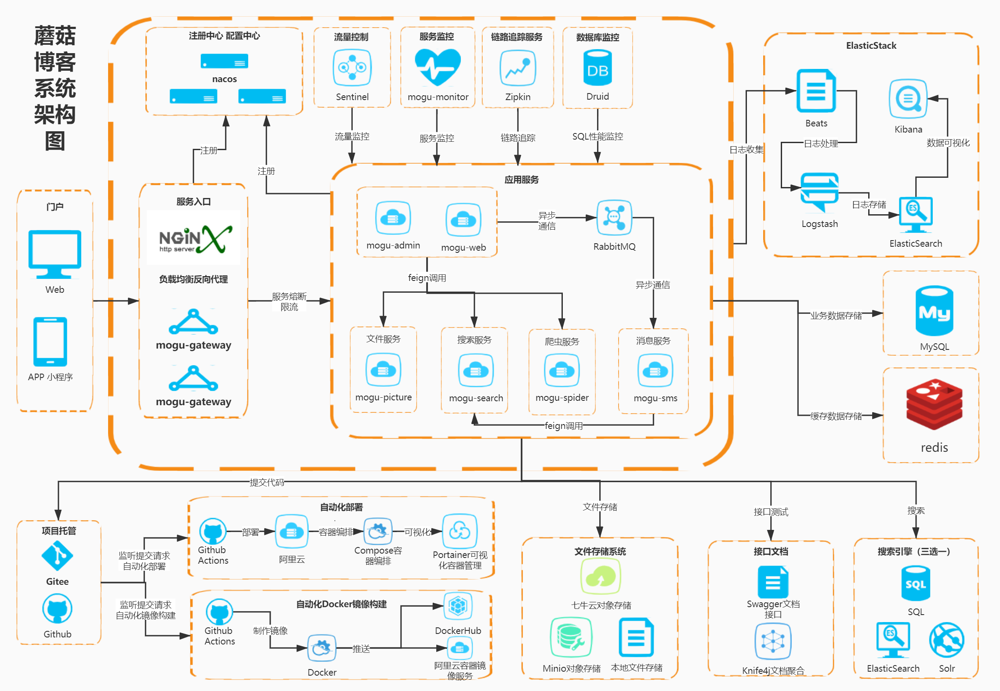

# 蘑菇社区Plus

  

    基于
    <a href="https://github.com/moxi624/mogu_blog_v2">
        蘑菇博客
    </a>
   重构升级，一个基于微服务架构的前后端分离门户系统

## 项目特点

- 友好的代码结构及注释，便于阅读及二次开发
- 实现前后端分离，通过 **Json** 进行数据交互，前端再也不用关注后端技术
- 引入**Swagger** 、**Knife** 文档支持，方便编写 **API** 接口文档。
- 引入**RabbitMQ** 消息队列，用于邮件发送、更新 **Redis** 和 **Solr**
- 引入**JustAuth** 第三方登录开源库，基于OAuth2协议，实现 **Gitee**、**Github** 第三方账号登录。
- 引入**ElasticSearch** 作为全文检索服务，并支持可插拔配置 (`未完善`)
- 引入**Github Actions** 工作流，完成蘑菇博客的持续集成、持续部署。
- 引入七牛云对象存储，引入腾讯云COS对象存储，同时支持本地文件存储(`未完善`)
- 引入 **RBAC** 权限管理设计，灵活的权限控制，按钮级别的细粒度权限控制，满足绝大部分的权限需求
- 引入 **Zipkin** 链路追踪，聚合各业务系统调用延迟数据，可以一眼看出延迟高的服务
- 采用**自定义参数校验注解**，轻松实现后端参数校验
- 采用 **AOP** + 自定义注解 + **Redis** 实现操作限流，限制IP接口访问次数
- 采用自研的评论模块，实现评论邮件通知
- 采用 **Nacos** 作为服务发现和配置中心，方便系统的统一配置和维护
- 采用 **Sentinel** 流量控制框架，通过配置再也不怕网站被爆破
- 支持多种文本编辑器，**Markdown** 编辑器和 **富文本** 编辑器随心切换
- 采用 **ElasticStack**【**ElasticSearch** + **Beats** + **Kibana** + **Logstash**】[搭建蘑菇博客日志收集]
- 采用 **Docker Compose** 完成容器编排，**Portainer** 实现容器可视化，支持[一键部署线上环境]

## 文档
### 项目文档：
地址 http://moxi159753.gitee.io/mogu_blog_doc
备用地址：http://doc.moguit.cn
### 接口文档：
地址 http://localhost:8601/swagger-ui/index.html

## 模组目录

- doc: 是蘑菇博客的一些文档和数据库文件
- mogu_admin: 提供admin端API接口服务
- mogu_base: 存放Base基类,用来被继承或实现，快速推进开发
- mogu_commons：公共模块，主要用于存放Entity实体类、Feign远程调用接口、以及公共config配置
- mogu_gateway：网关服务，控制访问规则
- mogu_monitor：监控服务，集成SpringBootAdmin用于管理和监控SpringBoot应用程序
- mogu_web：提供web端API接口服务,集成第三方登录
- mogu_picture： 图片服务，文件服务，用于图片和文件的上传和下载
- mogu_sms：消息服务，用于更新ElasticSearch、Solr索引、邮件和短信发送
- mogu_spider：爬虫服务`（目前还未完善）`
- mogu_search：搜索服务，ElasticSearch和Solr作为全文检索工具，默认使用SQL搜索
- mogu_utils: 是常用工具类,如 RedisUtils，ResultUtils
- mogu_xo: 存放 POJO,Mapper,Dao
- mogu_zipkin：链路追踪服务，目前使用java -jar的方式启动，官网下载 zipkin
- vue_mogu_admin：VUE的后台管理页面
- vue_mogu_web：VUE的门户网站

## 技术选型

### 系统架构图

>  蘑菇博客系统架构图，使用 [Processon](https://www.processon.com/i/5e380df1e4b05b335ffa81e9) 在线绘制

## 未来计划

- [x] 集成Github Actions，完成蘑菇博客持续集成服务
- [x] 门户网站增加登录页面
- [x] 支持第三方登录，QQ，微信，github，gitee
- [x] 集成ElasticSearch和Solr
- [x] 将图片存储在七牛云中，腾讯云对象存储COS
- [x] 写一个评论模块，用于替换搜狐畅言
- [x] 按钮级别的细粒度权限控制
- [x] 集成表单构建页面，来源于[RuoYi](https://gitee.com/y_project/RuoYi)
- [x] 增加博客详情页目录导航，来源于[vue-side-catalog](https://github.com/yaowei9363/vue-side-catalog)
- [x] 新建Nacos分支，用于替换Eureka作为服务发现组件和配置中心
- [x] 使用Sentinel做服务限流和熔断
- [x] 富文本编辑器和Markdown编辑器任意切换
- [x] 使用ELK搭建[蘑菇博客日志收集功能](http://www.moguit.cn/#/info?blogUid=fd9ab58588d93ef792ec72a359a09f6c)
- [x] 使用Minio [搭建对象存储服务](http://www.moguit.cn/#/info?blogUid=a1058b2d030310e2c5d7b0584e514f1f)
- [x] 使用DockerCompose完成 [博客一键部署](http://www.moguit.cn/info/565)
- [x] 使用Portainer对Docker镜像可视化管理
- [x] 适配门户页面的移动端布局
- [ ] 增加K8S部署蘑菇博客教程
- [ ] 增加大屏数据展示页面
- [ ] 增加定时任务模块
- [ ] 使用Freemark页面静态化技术对博客详情页静态化
- [ ] 解决Nuxt_mogu_web中存在的问题，使博客能被搜索引擎收录
- [ ] 让原创文章能够同步到多平台，如：CSDN，掘金，博客园等
- [ ] 增加博客迁移功能，让其它平台的博客，如：CSDN、博客园，WordPress能够同步到蘑菇博客中
- [ ] 让邮件发送的邮件携带附件
- [ ] 集成QQ、WeChat登录

## 项目中初始用户和密码

- **后台登录**：用户：admin，密码：admin
- 前台登录：用户：mogu2018，密码：mogu2018
- **Mysql**：用户：root，密码：mogu2018
- **Redis**：密码：mogu2018
- **远程SSH初始密码**：用户：root，密码：mogu2018
- **RabbitMQ管理页面：** 用户：admin，密码：mogu2018
- **Nacos管理页面：** 用户：nacos，密码：nacos
- **Sentinel管理页面：** 用户：sentinel，密码：sentinel
- **Monitor页面**：用户：user，密码：password123
- **Druid初始密码：** 用户：admin，密码：123456
